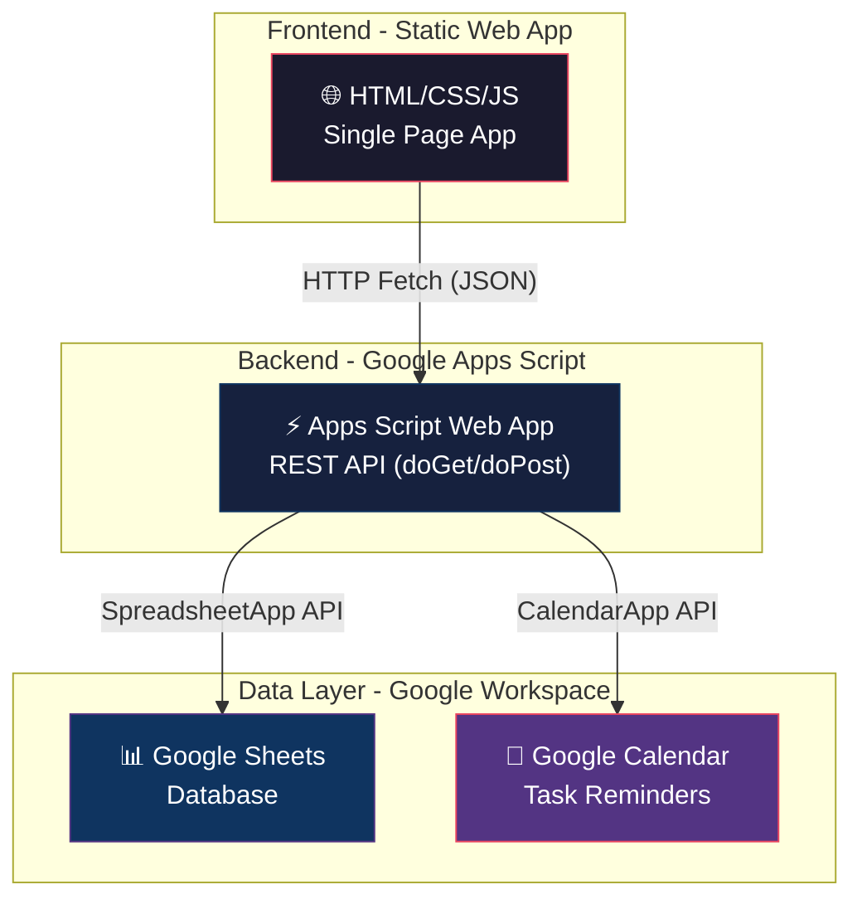
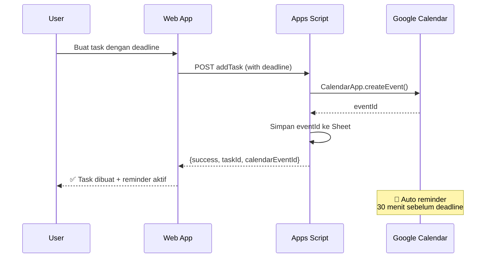

# 📋 PRD: FinanceKu — Personal Finance & Task Manager

> **Version**: 1.0  
> **Author**: AI Product Manager  
> **Tanggal**: 26 Juni 2026  
> **Status**: Draft — Menunggu Review

---

## 1. Executive Summary

**FinanceKu** adalah web app pribadi all-in-one untuk mengelola keuangan (pemasukan & pengeluaran) dan task/tugas harian. Aplikasi ini menggunakan **Google Sheets sebagai backend database** melalui **Google Apps Script (GAS) sebagai REST API**, serta terintegrasi dengan **Google Calendar** untuk manajemen tugas berbasis waktu.

### Why This Approach?
- **Zero Cost** — Tidak perlu bayar server/database
- **Google Sheets** = Database gratis + backup otomatis + mudah di-audit
- **Apps Script** = API gratis tanpa server
- **Google Calendar** = Reminder & scheduling gratis

---

## 2. Problem Statement

| Pain Point | Solusi FinanceKu |
|---|---|
| Mencatat keuangan di spreadsheet ribet & tidak visual | Dashboard visual dengan chart & ringkasan otomatis |
| Tidak ada gambaran cashflow bulanan | Analitik bulanan dengan trend & breakdown kategori |
| Task/tugas terpisah dari konteks keuangan | Unified app: keuangan + task dalam 1 platform |
| Lupa deadline tugas | Integrasi Google Calendar untuk reminder otomatis |
| Spreadsheet sulit diakses di mobile | Web app responsive, mobile-first design |

---

## 3. Target User

**Persona**: Individu (personal use) yang ingin:
- Tracking keuangan harian dengan mudah
- Mengelola task/tugas pribadi
- Mendapat insight keuangan otomatis
- Semua data tersimpan aman di Google Drive sendiri

---

## 4. Tech Architecture

### 4.1 System Overview



### 4.2 Google Sheets Schema

#### Sheet 1: `Transaksi` (Existing — dari screenshot)

| Column | Field | Type | Contoh | Keterangan |
|--------|-------|------|--------|-------------|
| A | `ID` | String (UUID) | `d4c677a2-e615-...` | Auto-generated UUID |
| B | `Tanggal` | Date | `2026-06-07` | Format ISO |
| C | `Tipe` | Enum | `Pemasukan` / `Pengeluaran` | Dropdown validation |
| D | `Kategori` | String | `Transportasi` | Dari daftar kategori |
| E | `Jumlah` | Number | `15000` | Dalam Rupiah, tanpa simbol |
| F | `Catatan` | String | `Moleh grab` | Opsional |
| G | `Dibuat Pada` | DateTime | `6/7/2026 5:35:51` | Auto-timestamp |

#### Sheet 2: `Tasks` (NEW)

| Column | Field | Type | Contoh | Keterangan |
|--------|-------|------|--------|-------------|
| A | `ID` | String (UUID) | `t-abc123` | Auto-generated |
| B | `Judul` | String | `Bayar listrik` | Required |
| C | `Deskripsi` | String | `PLN bulan Juni` | Opsional |
| D | `Prioritas` | Enum | `High` / `Medium` / `Low` | Default: Medium |
| E | `Status` | Enum | `Todo` / `In Progress` / `Done` | Default: Todo |
| F | `Deadline` | DateTime | `2026-06-30 17:00` | Opsional |
| G | `Kategori` | String | `Bills` / `Work` / `Personal` | Tag tugas |
| H | `Terkait_Jumlah` | Number | `500000` | Jika tugas terkait keuangan |
| I | `Calendar_Event_ID` | String | `google-cal-id` | Ref ke Google Calendar |
| J | `Dibuat_Pada` | DateTime | Auto | Auto-timestamp |
| K | `Selesai_Pada` | DateTime | Auto | Saat status → Done |

#### Sheet 3: `Kategori` (NEW)

| Column | Field | Type | Contoh |
|--------|-------|------|--------|
| A | `ID` | String | `kat-001` |
| B | `Nama` | String | `Transportasi` |
| C | `Tipe` | Enum | `Pemasukan` / `Pengeluaran` / `Keduanya` |
| D | `Ikon` | String | `🚗` (emoji) |
| E | `Warna` | String | `#FF6B6B` (hex) |

#### Sheet 4: `Settings` (NEW)

| Column | Field | Type | Contoh |
|--------|-------|------|--------|
| A | `Key` | String | `currency` |
| B | `Value` | String | `IDR` |
| C | `Updated_At` | DateTime | Auto |

### 4.3 Apps Script API Endpoints

```
BASE_URL = https://script.google.com/macros/s/{DEPLOYMENT_ID}/exec
```

| Method | Action | Params | Response |
|--------|--------|--------|----------|
| `GET` | `getTransaksi` | `?action=getTransaksi&bulan=6&tahun=2026` | Array transaksi |
| `GET` | `getSummary` | `?action=getSummary&bulan=6&tahun=2026` | Ringkasan keuangan |
| `GET` | `getTasks` | `?action=getTasks&status=Todo` | Array tasks |
| `GET` | `getKategori` | `?action=getKategori` | Array kategori |
| `GET` | `getDashboard` | `?action=getDashboard` | Agregasi dashboard |
| `POST` | `addTransaksi` | JSON body | `{success: true, id: "..."}` |
| `POST` | `updateTransaksi` | JSON body | `{success: true}` |
| `POST` | `deleteTransaksi` | `{id: "..."}` | `{success: true}` |
| `POST` | `addTask` | JSON body | `{success: true, id: "...", calendarId: "..."}` |
| `POST` | `updateTask` | JSON body | `{success: true}` |
| `POST` | `deleteTask` | `{id: "..."}` | `{success: true}` |
| `POST` | `syncCalendar` | `{taskId: "..."}` | `{success: true}` |

### 4.4 Google Calendar Integration



**Fitur Calendar**:
- Otomatis buat event saat task punya deadline
- Default reminder: 30 menit & 1 hari sebelum
- Saat task selesai → event dihapus/ditandai
- Saat task diupdate → event diupdate
- Menggunakan calendar default user (gratis)

---

## 5. Feature Specification

### 5.1 Module: Dashboard (Home)

**Tujuan**: Memberikan overview keuangan dan task dalam satu pandangan.

| Komponen | Deskripsi | Data Source |
|----------|-----------|-------------|
| **Greeting Card** | "Selamat Sore, Akmal 👋" + tanggal hari ini | Local |
| **Balance Card** | Saldo bulan ini (Pemasukan - Pengeluaran) | `getSummary` |
| **Quick Stats** | 3 kartu: Total Pemasukan, Total Pengeluaran, Jumlah Transaksi | `getSummary` |
| **Spending Chart** | Donut chart breakdown per kategori | `getSummary` |
| **Trend Chart** | Line/bar chart 7 hari terakhir | `getTransaksi` |
| **Recent Transactions** | 5 transaksi terbaru | `getTransaksi` |
| **Upcoming Tasks** | 5 task deadline terdekat | `getTasks` |
| **Quick Add FAB** | Floating Action Button untuk tambah transaksi/task cepat | - |

---

### 5.2 Module: Transaksi (Keuangan)

**Tujuan**: CRUD penuh untuk pencatatan keuangan.

#### 5.2.1 List View
- Filter: Bulan/Tahun, Tipe (Pemasukan/Pengeluaran), Kategori
- Sort: Tanggal (newest first default), Jumlah
- Search: By catatan
- Grouped by tanggal dengan subtotal per hari
- Infinite scroll / pagination

#### 5.2.2 Add/Edit Form
| Field | Type | Validation | Default |
|-------|------|------------|---------|
| Tipe | Toggle (Pemasukan/Pengeluaran) | Required | Pengeluaran |
| Jumlah | Number input + quick amount buttons | Required, > 0 | - |
| Kategori | Select grid dengan ikon | Required | - |
| Tanggal | Date picker | Required | Hari ini |
| Catatan | Text input | Optional, max 200 char | - |

**Quick Amount Buttons**: `5K`, `10K`, `15K`, `20K`, `25K`, `50K`, `100K`, `Custom`

#### 5.2.3 Detail View
- Informasi lengkap transaksi
- Edit & Delete actions
- Timestamp dibuat

#### 5.2.4 Summary View (Analitik)
| Komponen | Deskripsi |
|----------|-----------|
| **Monthly Overview** | Bar chart pemasukan vs pengeluaran per bulan |
| **Category Breakdown** | Donut chart + list dengan persentase |
| **Daily Average** | Rata-rata pengeluaran per hari |
| **Top Categories** | Top 5 kategori pengeluaran terbanyak |
| **Month Comparison** | Perbandingan bulan ini vs bulan lalu |

---

### 5.3 Module: Tasks (Tugas)

**Tujuan**: Manajemen tugas pribadi terintegrasi kalender.

#### 5.3.1 Task Board View (Default)
- **Kanban-style**: 3 kolom (Todo → In Progress → Done)
- Drag & drop antar kolom
- Badge prioritas (warna: High=merah, Medium=kuning, Low=hijau)
- Countdown deadline

#### 5.3.2 Task List View (Alternative)
- List dengan checkbox
- Filter: Status, Prioritas, Kategori
- Sort: Deadline, Prioritas, Created

#### 5.3.3 Add/Edit Task Form
| Field | Type | Validation | Default |
|-------|------|------------|---------|
| Judul | Text | Required, max 100 | - |
| Deskripsi | Textarea | Optional, max 500 | - |
| Prioritas | Select (High/Medium/Low) | Required | Medium |
| Deadline | DateTime picker | Optional | - |
| Kategori | Select | Optional | Personal |
| Terkait Jumlah | Number | Optional | - |
| Sync Calendar | Toggle | - | ON (jika ada deadline) |

#### 5.3.4 Calendar Sync Features
- ✅ Auto-create calendar event saat ada deadline
- ✅ Auto-update event saat deadline diubah
- ✅ Auto-delete event saat task dihapus
- ✅ Reminder: 1 hari + 30 menit sebelum deadline
- ✅ Event description berisi detail task

---

### 5.4 Module: Settings

| Setting | Deskripsi |
|---------|-----------|
| Nama User | Untuk greeting |
| Mata Uang | Default IDR |
| Kategori Manager | CRUD kategori custom |
| Theme | Dark / Light / Auto |
| Budget Bulanan | Set target budget per bulan |
| Apps Script URL | Konfigurasi endpoint API |

---

## 6. UI/UX Design Specification

### 6.1 Design Philosophy

> **"Dark Elegance meets Glassmorphism"**  
> Premium, modern, dan nyaman digunakan sehari-hari.

### 6.2 Color System

```
// Primary Palette — Deep Ocean
--bg-primary:       #0a0e27        // Background utama (deep navy)
--bg-secondary:     #131832        // Card background
--bg-tertiary:      #1a2040        // Elevated surfaces

// Accent Colors — Vibrant Neon
--accent-primary:   #6C63FF        // Primary purple (CTA, active states)
--accent-secondary: #00D4AA        // Teal green (pemasukan, success)
--accent-danger:    #FF6B6B        // Coral red (pengeluaran, delete)
--accent-warning:   #FFD93D        // Golden yellow (high priority)
--accent-info:      #4ECDC4        // Cyan (info, links)

// Text
--text-primary:     #FFFFFF        // Heading, primary text
--text-secondary:   #A0AEC0        // Secondary, labels
--text-muted:       #4A5568        // Disabled, hints

// Glassmorphism
--glass-bg:         rgba(255,255,255,0.05)
--glass-border:     rgba(255,255,255,0.1)
--glass-blur:       blur(20px)

// Gradients
--gradient-primary: linear-gradient(135deg, #6C63FF 0%, #4ECDC4 100%)
--gradient-income:  linear-gradient(135deg, #00D4AA 0%, #00B894 100%)
--gradient-expense: linear-gradient(135deg, #FF6B6B 0%, #EE5A24 100%)
--gradient-card:    linear-gradient(135deg, rgba(108,99,255,0.1) 0%, rgba(78,205,196,0.1) 100%)
```

### 6.3 Typography

```
// Font Stack
--font-primary:   'Inter', -apple-system, sans-serif     // Body text
--font-display:   'Outfit', sans-serif                   // Headings, numbers besar
--font-mono:      'JetBrains Mono', monospace            // Amounts, data

// Scale
--text-xs:    0.75rem    // 12px — captions
--text-sm:    0.875rem   // 14px — secondary
--text-base:  1rem       // 16px — body
--text-lg:    1.125rem   // 18px — emphasis
--text-xl:    1.25rem    // 20px — subheading
--text-2xl:   1.5rem     // 24px — heading
--text-3xl:   1.875rem   // 30px — page title
--text-4xl:   2.25rem    // 36px — hero number (saldo)
```

### 6.4 Spacing & Layout

```
// Spacing Scale (8px base)
--space-1:  0.25rem    // 4px
--space-2:  0.5rem     // 8px
--space-3:  0.75rem    // 12px
--space-4:  1rem       // 16px
--space-5:  1.25rem    // 20px
--space-6:  1.5rem     // 24px
--space-8:  2rem       // 32px
--space-10: 2.5rem     // 40px
--space-12: 3rem       // 48px

// Border Radius
--radius-sm:   8px
--radius-md:   12px
--radius-lg:   16px
--radius-xl:   20px
--radius-full: 9999px

// Shadows
--shadow-sm:   0 2px 8px rgba(0,0,0,0.2)
--shadow-md:   0 4px 16px rgba(0,0,0,0.3)
--shadow-lg:   0 8px 32px rgba(0,0,0,0.4)
--shadow-glow: 0 0 20px rgba(108,99,255,0.3)
```

### 6.5 Component Design Guide

#### 6.5.1 Navigation — Bottom Tab Bar (Mobile-First)

```
┌──────────────────────────────────────────┐
│                                          │
│           [ Main Content Area ]          │
│                                          │
│                                          │
├──────────────────────────────────────────┤
│  🏠        📊        ➕        ✅    ⚙️   │
│  Home    Transaksi  (FAB)    Tasks  Setting│
│  ────                                    │
│  active                                  │
└──────────────────────────────────────────┘

Specs:
- Height: 64px
- Background: var(--bg-secondary) + backdrop-filter: blur(20px)
- Active indicator: pill shape, var(--accent-primary) bg with glow
- FAB (center): 56px circle, gradient background, elevated -20px
- Icons: 24px, Lucide Icons or Phosphor Icons
- Labels: 10px, only shown for active tab on mobile
```

#### 6.5.2 Cards — Glass Card

```
┌─────────────────────────────────────┐
│  ╭─────────────────────────────╮    │
│  │ 💰 Total Saldo              │    │
│  │                             │    │
│  │   Rp 2.450.000             │    │
│  │   ▲ 12% dari bulan lalu    │    │
│  │                             │    │
│  │  ┌──────────┐ ┌──────────┐ │    │
│  │  │ ↑ 5.2jt  │ │ ↓ 2.7jt  │ │    │
│  │  │ Masuk    │ │ Keluar   │ │    │
│  │  └──────────┘ └──────────┘ │    │
│  ╰─────────────────────────────╯    │
│                                     │
│  Card Specs:                        │
│  - bg: var(--glass-bg)              │
│  - border: 1px solid var(--glass-border) │
│  - border-radius: var(--radius-lg)  │
│  - backdrop-filter: var(--glass-blur)│
│  - padding: var(--space-6)          │
│  - Subtle gradient overlay          │
│  - Hover: slight scale(1.01) + glow │
└─────────────────────────────────────┘
```

#### 6.5.3 Transaction Item

```
┌─────────────────────────────────────┐
│  ┌──┐                              │
│  │🚗│  Transportasi       -Rp15.000│
│  └──┘  Moleh grab • 07 Jun     RED │
│  icon  ─────────────────           │
│  40px  category          amount    │
│  bg    note + date       colored   │
│                                    │
│  Specs:                            │
│  - Icon: 40x40 rounded-lg, bg: kategori color + 0.15 opacity │
│  - Amount: font-mono, right-aligned│
│  - Pengeluaran: var(--accent-danger)│
│  - Pemasukan: var(--accent-secondary)│
│  - Swipe left: Delete (red)        │
│  - Swipe right: Edit (blue)        │
│  - Tap: expand detail              │
└─────────────────────────────────────┘
```

#### 6.5.4 Add Transaction Modal / Sheet

```
┌─────────────────────────────────────┐
│  ╭─────────────────────────────╮    │
│  │  ──── (drag handle)         │    │
│  │                             │    │
│  │  ┌─────────┬─────────┐     │    │
│  │  │PENGELUAR│PEMASUKAN│     │    │
│  │  │  ✓ ON   │         │     │    │
│  │  └─────────┴─────────┘     │    │
│  │                             │    │
│  │  Jumlah:                    │    │
│  │  ┌──────────────────────┐   │    │
│  │  │    Rp 0              │   │    │
│  │  └──────────────────────┘   │    │
│  │                             │    │
│  │  ┌────┐┌────┐┌────┐┌────┐  │    │
│  │  │ 5K ││10K ││15K ││20K │  │    │
│  │  └────┘└────┘└────┘└────┘  │    │
│  │  ┌────┐┌────┐┌────────────┐│    │
│  │  │25K ││50K ││   100K    ││    │
│  │  └────┘└────┘└────────────┘│    │
│  │                             │    │
│  │  Kategori:                  │    │
│  │  ┌──┐ ┌──┐ ┌──┐ ┌──┐       │    │
│  │  │🍔│ │🚗│ │🛒│ │💊│       │    │
│  │  │Mkn│ │Trn│ │Blj│ │Kes│   │    │
│  │  └──┘ └──┘ └──┘ └──┘       │    │
│  │  ┌──┐ ┌──┐ ┌──┐ ┌──┐       │    │
│  │  │🎮│ │📱│ │🏠│ │➕│       │    │
│  │  │Hib│ │Plsa││Rmh│ │Lain│  │    │
│  │  └──┘ └──┘ └──┘ └──┘       │    │
│  │                             │    │
│  │  📅 Hari ini, 26 Jun 2026   │    │
│  │  📝 Tambah catatan...       │    │
│  │                             │    │
│  │  ┌──────────────────────┐   │    │
│  │  │    💾 SIMPAN          │   │    │
│  │  └──────────────────────┘   │    │
│  ╰─────────────────────────────╯    │
│                                     │
│  Bottom Sheet Specs:                │
│  - Slide up animation (300ms ease)  │
│  - Backdrop: rgba(0,0,0,0.5) + blur │
│  - Border-radius top: var(--radius-xl)│
│  - Quick amounts: chip style, outlined │
│  - Category grid: 4 columns         │
│  - Save button: full-width, gradient │
│  - Haptic feedback on tap (if PWA)   │
└─────────────────────────────────────┘
```

#### 6.5.5 Task Card (Kanban)

```
┌─────────────────────────────────────┐
│  ╭─────────────────────────────╮    │
│  │ 🔴 HIGH                     │    │
│  │                             │    │
│  │ Bayar Listrik PLN           │    │
│  │ Tagihan bulan Juni          │    │
│  │                             │    │
│  │ 💰 Rp 500.000  📅 30 Jun   │    │
│  │                             │    │
│  │ ⏰ 4 hari lagi              │    │
│  │ ████████░░░░░░░░ 65%        │    │
│  ╰─────────────────────────────╯    │
│                                     │
│  Specs:                             │
│  - Priority badge: top-left, pill   │
│  - High: #FF6B6B, Medium: #FFD93D  │
│  - Low: #00D4AA                    │
│  - Amount tag: if terkait_jumlah   │
│  - Deadline countdown: dynamic color│
│  - < 1 day: red pulse animation    │
│  - < 3 days: orange                │
│  - > 3 days: default text          │
│  - Drag handle: top-right dots     │
│  - Subtle left border: priority clr│
└─────────────────────────────────────┘
```

### 6.6 Page Layouts (Wireframe Reference)

#### Dashboard Page
```
┌──────────────────────────────────────────┐
│  FinanceKu              🔔  👤           │
│                                          │
│  Selamat Sore, Akmal 👋                  │
│  Kamis, 26 Juni 2026                     │
│                                          │
│  ╭────────────────────────────────────╮   │
│  │  SALDO BULAN INI                   │   │
│  │                                    │   │
│  │      Rp 2.450.000                 │   │
│  │      ▲ +12.5% vs bulan lalu      │   │
│  │                                    │   │
│  │  ┌──────────┐  ┌──────────┐       │   │
│  │  │ ↑ 5.2jt  │  │ ↓ 2.7jt  │      │   │
│  │  │ Masuk ✨  │  │ Keluar   │      │   │
│  │  └──────────┘  └──────────┘       │   │
│  ╰────────────────────────────────────╯   │
│                                          │
│  📊 Pengeluaran Minggu Ini               │
│  ╭────────────────────────────────────╮   │
│  │                                    │   │
│  │   ██  ██      ██                  │   │
│  │   ██  ██  ██  ██                  │   │
│  │   ██  ██  ██  ██  ██  ██         │   │
│  │   Sen Sel Rab Kam Jum Sab         │   │
│  │                                    │   │
│  ╰────────────────────────────────────╯   │
│                                          │
│  🏷️ Top Kategori                         │
│  ╭────────────────────────────────────╮   │
│  │  🍔 Makanan ████████░░ Rp 800K    │   │
│  │  🚗 Transport████████░ Rp 650K    │   │
│  │  🛒 Belanja █████░░░░ Rp 450K    │   │
│  ╰────────────────────────────────────╯   │
│                                          │
│  📝 Transaksi Terbaru    Lihat Semua →   │
│  ╭────────────────────────────────────╮   │
│  │  🚗 Transportasi    -Rp15.000     │   │
│  │     Moleh grab • 07 Jun           │   │
│  │  ─────────────────────────        │   │
│  │  🍔 Makanan          -Rp25.000    │   │
│  │     Makan siang • 07 Jun         │   │
│  ╰────────────────────────────────────╯   │
│                                          │
│  ✅ Tugas Mendesak       Lihat Semua →   │
│  ╭────────────────────────────────────╮   │
│  │  🔴 Bayar Listrik   ⏰ 4 hari     │   │
│  │  🟡 Review laporan  ⏰ 1 minggu   │   │
│  ╰────────────────────────────────────╯   │
│                                          │
│                                          │
│  🏠      📊      ➕      ✅      ⚙️      │
│  Home  Trans   (FAB)   Tasks  Settings   │
└──────────────────────────────────────────┘
```

### 6.7 Animations & Micro-interactions

| Element | Animation | Duration | Easing |
|---------|-----------|----------|--------|
| Page transition | Slide + fade | 300ms | `ease-out` |
| Card appear | Fade-up stagger | 400ms, 50ms delay each | `cubic-bezier(0.16, 1, 0.3, 1)` |
| FAB press | Scale down → up + ripple | 200ms | `ease-in-out` |
| Bottom sheet | Slide up from bottom | 350ms | `cubic-bezier(0.32, 0.72, 0, 1)` |
| Number count-up | Counter animation for amounts | 800ms | `ease-out` |
| Chart draw | SVG path draw animation | 1000ms | `ease-in-out` |
| Toggle switch | Smooth slide with bounce | 250ms | `cubic-bezier(0.68, -0.55, 0.265, 1.55)` |
| Delete swipe | Slide out + shrink height | 300ms | `ease-in` |
| Success feedback | Checkmark draw + confetti | 500ms | `ease-out` |
| Loading skeleton | Shimmer gradient animation | 1.5s loop | `linear` |
| Hover glow | Box-shadow expansion | 200ms | `ease` |
| Tab switch | Indicator pill slide | 250ms | `ease-out` |
| Task drag | Lift + shadow increase | 150ms | `ease` |
| Deadline pulse | Opacity pulse (urgent) | 2s loop | `ease-in-out` |

### 6.8 Responsive Breakpoints

```css
/* Mobile First */
@media (min-width: 0px)    { /* Base - 1 column */ }
@media (min-width: 640px)  { /* SM - still mobile, wider */ }
@media (min-width: 768px)  { /* MD - tablet, sidebar appears */ }
@media (min-width: 1024px) { /* LG - desktop, full sidebar */ }
@media (min-width: 1280px) { /* XL - wide desktop, dashboard grid */ }
```

| Breakpoint | Layout | Navigation |
|------------|--------|------------|
| < 768px | Single column, stacked cards | Bottom tab bar |
| 768–1024px | 2-column grid where applicable | Side rail (icons only) |
| > 1024px | Multi-column dashboard grid | Full sidebar with labels |

---

## 7. Project Structure (Frontend)

```
kita/
├── index.html                    # Entry point / SPA shell
├── css/
│   ├── index.css                 # Design system (tokens, reset, utilities)
│   ├── components.css            # Reusable component styles
│   ├── pages.css                 # Page-specific styles
│   └── animations.css            # Keyframes & transitions
├── js/
│   ├── app.js                    # Main app (router, init, state)
│   ├── api.js                    # Apps Script API client
│   ├── router.js                 # Simple SPA router (hash-based)
│   ├── store.js                  # Simple state management
│   ├── utils.js                  # Formatters, helpers, UUID
│   ├── components/
│   │   ├── navbar.js             # Bottom nav / sidebar
│   │   ├── modal.js              # Bottom sheet / modal
│   │   ├── chart.js              # Chart components (Canvas/SVG)
│   │   ├── toast.js              # Toast notifications
│   │   ├── skeleton.js           # Loading skeletons
│   │   └── fab.js                # Floating Action Button
│   └── pages/
│       ├── dashboard.js          # Dashboard page
│       ├── transactions.js       # Transactions list + add/edit
│       ├── analytics.js          # Financial analytics
│       ├── tasks.js              # Tasks kanban/list
│       └── settings.js           # Settings page
├── assets/
│   ├── icons/                    # SVG icons
│   └── images/                   # App images
├── appscript/
│   ├── Code.gs                   # Main Apps Script file
│   ├── Transaksi.gs              # Transaction CRUD
│   ├── Tasks.gs                  # Task CRUD + Calendar sync
│   ├── Helpers.gs                # Utility functions
│   └── appsscript.json           # Apps Script manifest
└── manifest.json                 # PWA manifest (optional)
```

---

## 8. Development Phases

### Phase 1: Foundation (Sprint 1) ⏱️ ~3-4 hari
- [x] Project setup & file structure
- [ ] Design system (CSS tokens, components)
- [ ] Apps Script: Setup sheets + basic CRUD transaksi
- [ ] API client module
- [ ] SPA router
- [ ] Bottom navigation

### Phase 2: Core Finance (Sprint 2) ⏱️ ~3-4 hari
- [ ] Dashboard page (summary, recent transactions)
- [ ] Transaction list page (filter, search, grouped)
- [ ] Add/Edit transaction bottom sheet
- [ ] Delete transaction with confirmation
- [ ] Category management
- [ ] Number formatting (Rupiah)

### Phase 3: Analytics (Sprint 3) ⏱️ ~2-3 hari
- [ ] Summary cards (count-up animation)
- [ ] Spending chart (donut/pie)
- [ ] Daily trend chart (bar)
- [ ] Monthly comparison
- [ ] Category breakdown

### Phase 4: Tasks + Calendar (Sprint 4) ⏱️ ~3-4 hari
- [ ] Task CRUD
- [ ] Kanban board view
- [ ] List view with checkboxes
- [ ] Google Calendar integration (Apps Script)
- [ ] Deadline countdown & priority system

### Phase 5: Polish (Sprint 5) ⏱️ ~2-3 hari
- [ ] Settings page
- [ ] Dark/Light theme toggle
- [ ] All animations & micro-interactions
- [ ] Loading states & skeletons
- [ ] Error handling & offline fallback
- [ ] Performance optimization

---

## 9. Non-Functional Requirements

| Requirement | Target |
|-------------|--------|
| First Paint | < 1.5s |
| API Response | < 2s (Apps Script limitation) |
| Mobile Responsive | 320px → 1920px |
| Browser Support | Chrome 90+, Firefox 88+, Safari 14+, Edge 90+ |
| Offline | Graceful degradation (show cached data) |
| Data Safety | Data stays in user's own Google Sheet |
| Bundle Size | < 200KB total (no framework) |

---

## 10. Risks & Mitigations

| Risk | Impact | Mitigation |
|------|--------|------------|
| Apps Script cold start (2-5s) | Slow first load | Loading skeleton + cache last response in localStorage |
| Apps Script daily quota (20K calls) | Rate limit | Batch requests, aggressive caching |
| Google Calendar API permissions | Setup complexity | Clear setup guide + fallback mode tanpa calendar |
| No auth | Security concern | App ini personal only; Apps Script deployed as "Execute as me, access only myself" |
| Sheet concurrent writes | Data conflict | UUID-based idempotency + timestamp conflict resolution |

---

## 11. Success Metrics

| Metric | Target |
|--------|--------|
| Daily active usage | User mencatat minimal 1 transaksi/hari |
| Data accuracy | 100% sync antara web app & sheet |
| Task completion | 80%+ tasks marked as done before deadline |
| Load time | Dashboard render < 3 detik |
| User satisfaction | Smooth, premium feel, no frustration |

---

## User Review Required

> [!IMPORTANT]
> **Beberapa hal yang perlu keputusan Anda:**
> 
> 1. **Nama Spreadsheet**: Apakah tetap "FINANCEKU" atau mau diganti?
> 2. **Kategori Default**: Apakah daftar kategori berikut sudah sesuai?
>    - **Pengeluaran**: Makanan, Transportasi, Belanja, Kesehatan, Hiburan, Pulsa/Internet, Rumah Tangga, Pendidikan, Lainnya
>    - **Pemasukan**: Gaji, Freelance, Investasi, Hadiah, Lainnya
> 3. **Calendar Integration**: Apakah sudah punya Google Calendar? Mau langsung implementasi atau Phase 2?
> 4. **Deployment**: Frontend mau di-deploy di mana? (GitHub Pages gratis, atau cukup lokal dulu?)

## Open Questions

> [!NOTE]
> 1. Apakah ada fitur budget limit per kategori yang diinginkan?
> 2. Apakah perlu fitur export ke PDF/CSV?
> 3. Apakah ada preferensi chart library tertentu (atau kita buat custom SVG)?
> 4. Apakah mau ada fitur "recurring transaction" (tagihan bulanan otomatis)?
